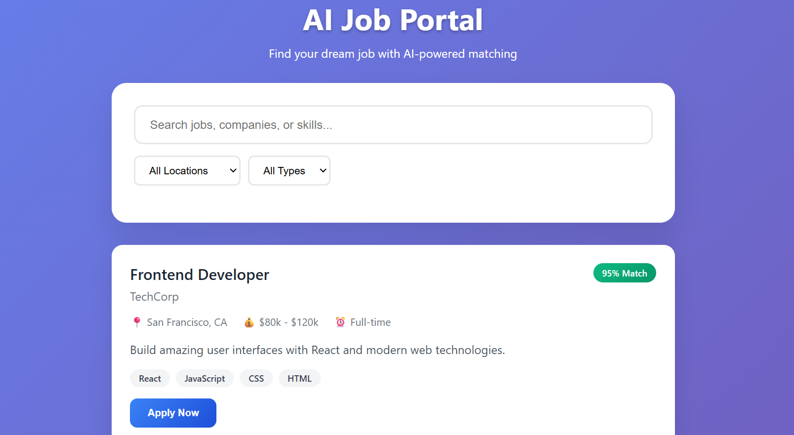
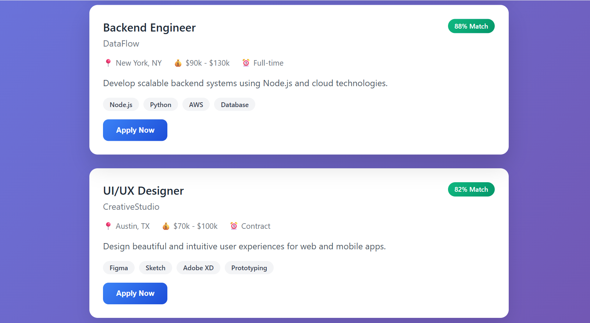
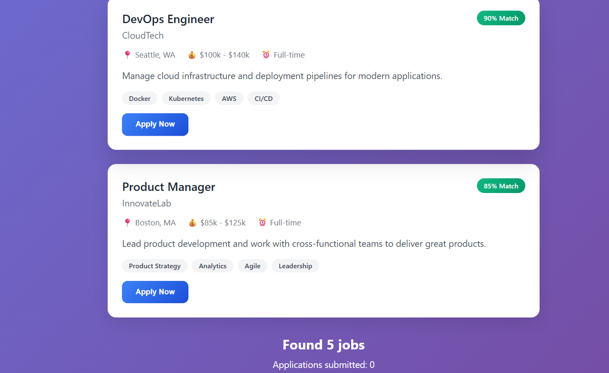
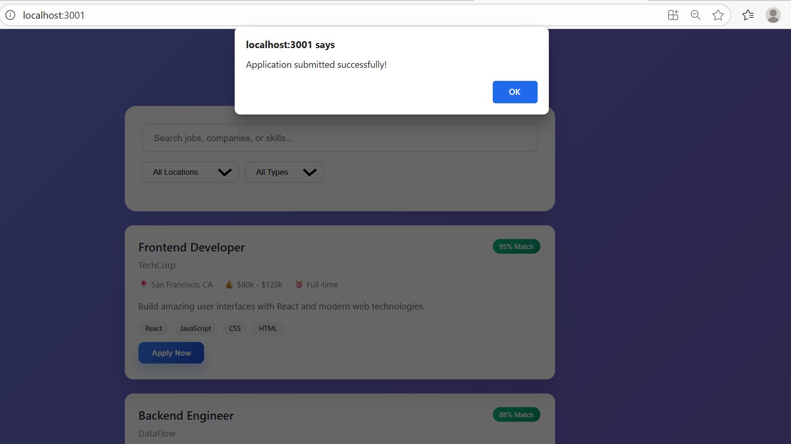
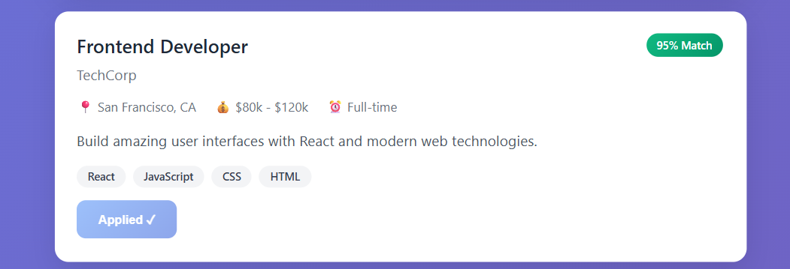
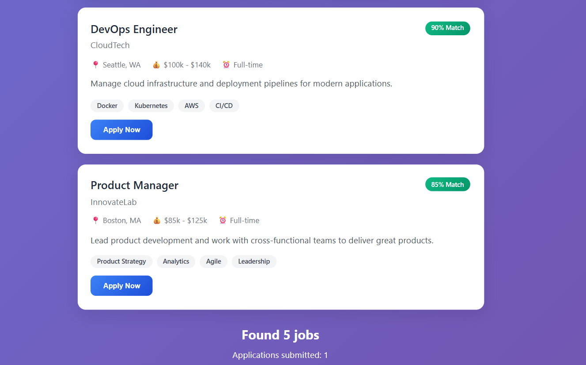

# AI Job Portal 🚀

A React-based job portal that helps candidates find their dream job with AI-powered matching.

---

## 🔹 Features

- 🔍 Search jobs by **title**, **company**, or **skills**  
- 📍 Filter jobs by **location** and **job type**  
- 🤖 AI match percentage for each job to show suitability  
- ✅ Apply to jobs and track applications  
- 📊 Displays the total jobs found and applications submitted  

---

## 📸 Preview

Use the buttons below each job card to apply and track your applications.

---

## 💻 Technology Stack

- **Frontend:** React.js, HTML, CSS  
- **State Management:** React Hooks (useState, useEffect)  
- **Version Control:** Git & GitHub 